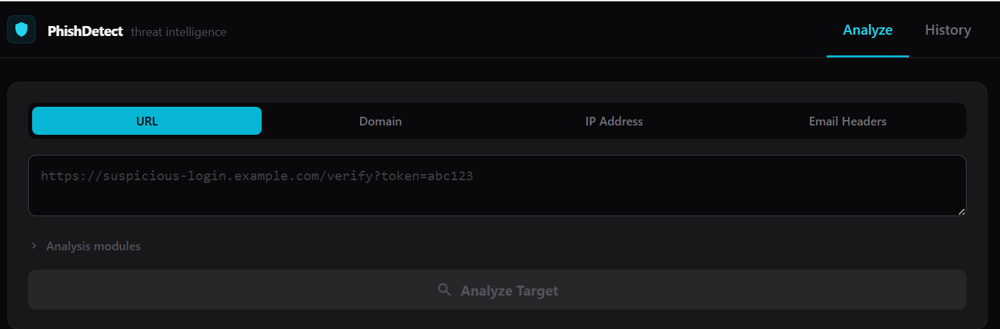
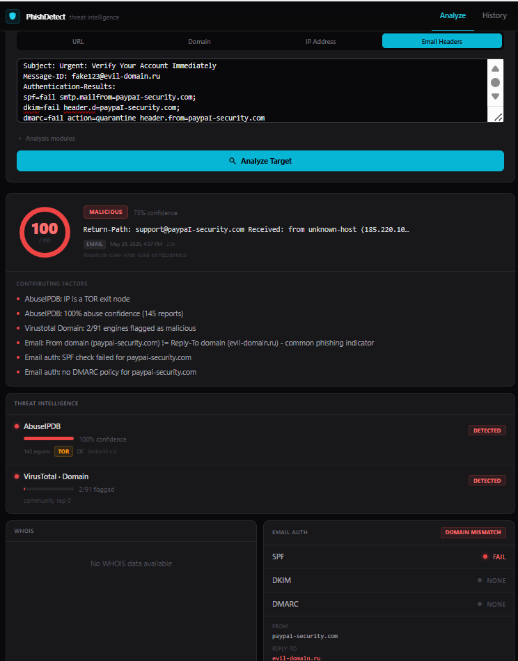

# Phishing Analyzer

A full-stack SOC (Security Operations Center) threat intelligence platform that analyzes URLs, domains, IP addresses, and raw email headers for phishing indicators and malicious activity.

---

## Features

- **Multi-target scanning** — URL, domain, IP address, and raw email header analysis
- **VirusTotal integration** — 90+ engine detection ratio with community reputation scoring
- **AbuseIPDB integration** — Abuse confidence score, TOR exit node detection, ISP/country data
- **WHOIS lookup** — Domain age, registrar, registration and expiry dates
- **Email authentication** — SPF, DKIM, and DMARC verification; From/Reply-To domain mismatch detection
- **Risk engine** — Multi-signal weighted scoring (0–100) producing CLEAN / SUSPICIOUS / MALICIOUS verdicts
- **AI verdict** — Gemini 2.0 Flash generates a structured analyst summary, key indicators, and recommended action
- **Caching** — Redis cache-aside pattern; PostgreSQL deduplication for recent scans
- **Scan history** — Filterable table of past scans, click any row to reload full results
- **Dark SOC dashboard** — React + Tailwind CSS frontend with circular risk gauge, inline detection bars, and traffic-light email auth indicators

---

## Screenshots

### Analyze Tab


### Scan Result — Phishing Email Headers


---

## Tech Stack

| Layer | Technology |
|---|---|
| **Frontend** | React 18, TypeScript, Vite, Tailwind CSS |
| **Backend** | FastAPI, Python 3.12, Pydantic v2, SQLAlchemy 2 (async) |
| **Database** | PostgreSQL (via asyncpg) + Alembic migrations |
| **Cache** | Redis |
| **Threat Intel** | VirusTotal API v3, AbuseIPDB API v2 |
| **WHOIS / DNS** | python-whois, dnspython |
| **AI Verdict** | Google Gemini 2.0 Flash (free tier) |
| **Containerisation** | Docker, Docker Compose |

---

## Architecture

```
┌─────────────────────────────────────────────────────────────┐
│  React Frontend (Vite · port 5173 dev / 3000 Docker)        │
│  ├── ScanForm      → POST /api/v1/scan                      │
│  ├── ScanResult    → Circular gauge · threat intel bars      │
│  ├── AIVerdictCard → Gemini structured verdict               │
│  └── ScanHistory   → GET /api/v1/scans                      │
└──────────────────────────┬──────────────────────────────────┘
                           │ HTTP / JSON
┌──────────────────────────▼──────────────────────────────────┐
│  FastAPI Backend (Uvicorn · port 8000)                      │
│  ├── ScanService (orchestrator)                             │
│  │   ├── Redis cache-aside lookup                           │
│  │   ├── PostgreSQL deduplication (1h window)               │
│  │   ├── VirusTotalClient      async HTTP → VT API v3       │
│  │   ├── AbuseIPDBClient       async HTTP → AbuseIPDB v2    │
│  │   ├── WhoisService          sync in thread pool          │
│  │   ├── EmailAuthService      DNS TXT via dnspython        │
│  │   ├── RiskEngine            weighted multi-signal score  │
│  │   └── AIVerdictService      Gemini 2.0 Flash JSON mode   │
│  └── ScanRepository → PostgreSQL (SQLAlchemy async)         │
└──────────────────────────┬──────────────────────────────────┘
                           │
              ┌────────────┴────────────┐
              │                         │
     ┌────────▼────────┐    ┌──────────▼──────────┐
     │   PostgreSQL    │    │        Redis         │
     │  (scan history) │    │   (result cache)     │
     └─────────────────┘    └──────────────────────┘
```

---

## Quick Start — Docker Compose (Recommended)

### Prerequisites

- [Docker Desktop](https://www.docker.com/products/docker-desktop/)
- API keys for [VirusTotal](https://www.virustotal.com/gui/my-apikey), [AbuseIPDB](https://www.abuseipdb.com/account/api), and [Google AI Studio](https://aistudio.google.com/app/apikey) (all free tiers available)

### 1. Clone the repository

```bash
git clone https://github.com/Emmanuelchang2006/Phishing-Analyzer.git
cd Phishing-Analyzer
```

### 2. Configure environment variables

```bash
cp backend/.env.example backend/.env
```

Open `backend/.env` and fill in your API keys:

```env
VIRUSTOTAL_API_KEY="your-virustotal-key"
ABUSEIPDB_API_KEY="your-abuseipdb-key"
GEMINI_API_KEY="your-gemini-key"       # optional — enables AI verdict panel
```

### 3. Start all services

```bash
docker-compose up --build
```

| Service | URL |
|---|---|
| Frontend | http://localhost:3000 |
| Backend API | http://localhost:8000 |
| API Docs (Swagger) | http://localhost:8000/docs |

---

## Manual Setup (No Docker)

### Backend

```bash
cd backend
python -m venv .venv

# Windows
.venv\Scripts\activate
# macOS / Linux
source .venv/bin/activate

pip install -r requirements.txt
cp .env.example .env
# Edit .env with your API keys

uvicorn app.main:app --reload --port 8000
```

> **Note:** Without PostgreSQL and Redis running locally, the backend still works — DB and cache failures are non-fatal. Only scan persistence and caching are affected.

### Frontend

```bash
cd frontend
npm install
npm run dev
```

Frontend runs at **http://localhost:5173** and proxies `/api` to `http://localhost:8000`.

---

## API Keys

| Key | Where to get | Required? |
|---|---|---|
| `VIRUSTOTAL_API_KEY` | [virustotal.com/gui/my-apikey](https://www.virustotal.com/gui/my-apikey) | Yes — enables engine detection |
| `ABUSEIPDB_API_KEY` | [abuseipdb.com/account/api](https://www.abuseipdb.com/account/api) | Yes — enables abuse/TOR data |
| `GEMINI_API_KEY` | [aistudio.google.com/app/apikey](https://aistudio.google.com/app/apikey) | No — enables AI verdict panel |

All three have **free tiers** with generous limits. The app runs without Gemini — the AI verdict panel is simply hidden.

---

## Risk Scoring

The risk engine aggregates signals from all sources into a score from 0–100:

| Signal | Points |
|---|---|
| VirusTotal ≥ 5 malicious engines | +40 |
| VirusTotal 1–4 malicious engines | +25 |
| VirusTotal suspicious engines only | +15 |
| VT community reputation ≤ −50 | +15 |
| VT community reputation ≤ −10 | +8 |
| AbuseIPDB confidence ≥ 80% | +30 |
| AbuseIPDB confidence 25–79% | +15 |
| AbuseIPDB confidence 5–24% | +8 |
| AbuseIPDB TOR exit node | +20 |
| Domain registered < 7 days | +30 |
| Domain registered < 30 days | +20 |
| Domain registered < 90 days | +10 |
| SPF fail or none | +10 |
| DMARC fail or none | +10 |
| From ≠ Reply-To domain | +15 |
| DKIM signature invalid | +5 |

**Floor rule:** TOR exit nodes always score at least 25 (SUSPICIOUS), regardless of other signals.

| Score | Level |
|---|---|
| 0–24 | CLEAN |
| 25–74 | SUSPICIOUS |
| 75–100 | MALICIOUS |

---

## Project Structure

```
phishing-analyzer/
├── backend/
│   ├── app/
│   │   ├── core/           # Config, logging
│   │   ├── routers/        # FastAPI route handlers
│   │   ├── schemas/        # Pydantic request/response models
│   │   ├── services/       # Business logic (VT, AbuseIPDB, WHOIS, AI, risk engine)
│   │   ├── repositories/   # PostgreSQL data access layer
│   │   ├── cache/          # Redis client helpers
│   │   └── db/             # SQLAlchemy models + session factory
│   ├── alembic/            # Database migrations
│   ├── Dockerfile
│   ├── requirements.txt
│   └── .env.example
├── frontend/
│   ├── src/
│   │   ├── components/     # ScanForm, ScanResult, AIVerdictCard, ThreatIntelSection, ...
│   │   ├── api/            # client.ts — typed fetch wrappers
│   │   └── types/          # TypeScript interfaces (ScanResponse, RiskScore, ...)
│   ├── Dockerfile
│   └── nginx.conf
└── docker-compose.yml
```

---

## API Reference

### `POST /api/v1/scan`

Submit a target for analysis.

**Request body:**
```json
{
  "target": "https://suspicious-login.example.com",
  "scan_type": "url",
  "options": {
    "check_virustotal": true,
    "check_abuseipdb": true,
    "check_whois": true,
    "check_email_auth": true,
    "generate_ai_verdict": true
  }
}
```

`scan_type` accepts: `url` · `domain` · `ip` · `email`

**Response:** `ScanResponse` — includes `risk_score`, `threat_intel`, `whois`, `email_auth`, `ai_verdict`

### `GET /api/v1/scans`

Returns recent scan history. Optional query params: `limit` (default 50), `risk_level` (`clean` / `suspicious` / `malicious`).

### `GET /api/v1/scan/{scan_id}`

Returns a single scan result by ID.

### `GET /api/v1/health`

Returns service health status (DB, Redis, uptime).